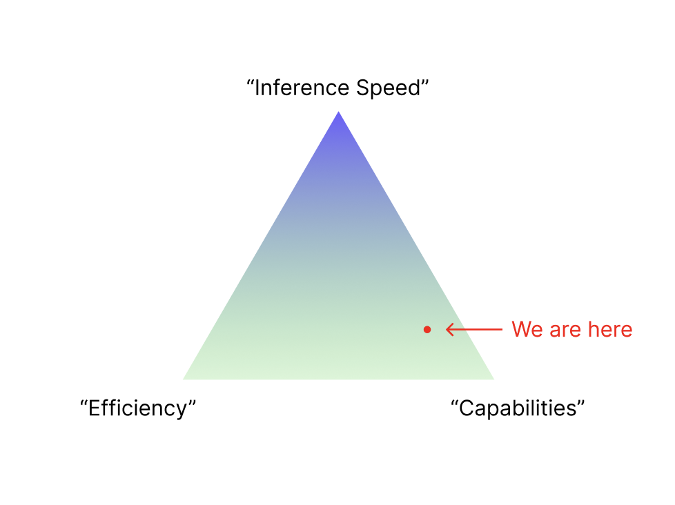
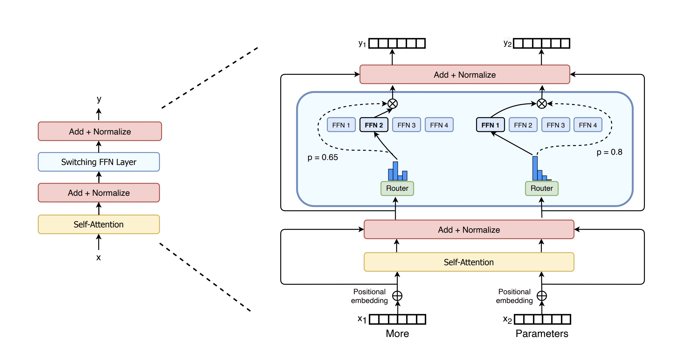
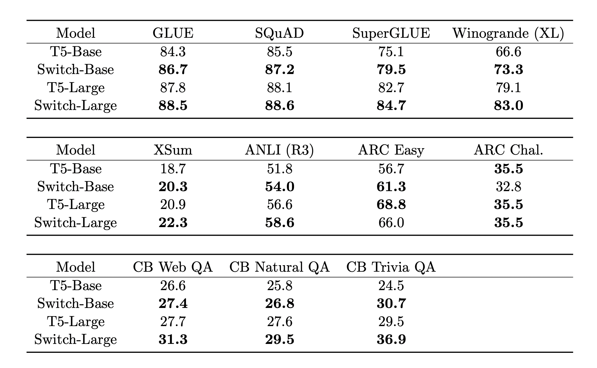

## Hydra-MoE: A new class of Open-Source Mixture of Experts

🤗 <a href="https://huggingface.co/HydraLM" target="_blank">HF Repo</a> • 🐦 <a href="https://twitter.com/skunkworks_ai" target="_blank">Twitter</a> • ⚡ <a href="https://github.com/hydrallm" target="_blank">Github</a> • 👋 Join our <a href="discord.gg/bNKsa8gE2y" target="_blank">Discord</a>  

## Mission
A scalable, efficient and Open Source Mixture of Experts (MoE) architecture to enable OSS AI to achieve SOTA (GPT-4 level) performance.

## Description

Skunkworks OSS team introduces Hydra-MoE, an innovative Mixture of Experts (MoE) architecture that leverages LoRA/QLoRA experts to scale and augment the performance of base language models. The central aim of this research is to transmute any base language model into an advanced, lightweight, efficient MoE framework, employing swappable QLoRA Expert Adapters, with the objective of achieving performance levels that rival state-of-the-art model and can run on commodity hardware. 

## Project Status

This project has completed POC stage and is currently training, optimizing, evaluating and scaling several MoE architectures developed by our team.

## Goals

Our objectives for this project are:
- Enhance Llama-2 (or any base model) capabilities closer to GPT-4 level performance through MoE architecture
- Serve as an exhaustive open source attempt to validate MoE techniques for large language models 
- Release open source and effective MoE models, framework and infrastructure for scaling capabilities of any LLMs.

## Our Architectures

We have designed and developed several MoE architectures which have achieved promising early results.

1. Hydra-α: Swappable-QLoRA experts MoE
   - c-BTM Inspired
   - K-means clustering for unsupervised domain discovery from instruct dataset
   - QLoRA finetuned experts on discovered clusters
   - Dynamic swapping of QLoRA Experts at inference through similarity and classifier based methods
   - Weighted-average merging of experts with base model at inference
     
2. Hydra-β: End-to-End MoE-QLoRA
   - An Extension to Hydra-α with better Gating, merging and an E2E training method
   - Expert merging through TIES merging and other methods
   - End-to-End Training of gating/routing functions with exotic loss/reward functions

3. Hydra-γ: Switch-MoE-QLoRA
   - Switch Transformer Inspired 
   - End-to-End finetuning approach
   - Frozen pre-trained base
   - Token-wise routing function with LoRA experts
   - Stable routing: Auxiliary loss to penalize high variance between experts, and Z-Loss to reduce expert logits

These architectures are currently being trained on further data and scaled to larger sizes. 
Early results indicate our MoE architectures outperform base model across several benchmarks. These results are currently being validated/replicated before being published.

## Evaluation Criteria

We evaluate Hydra-MoEs using the LM-Evaluation-Harness, Fast-Eval and human evaluations in order to compare capabilities to the base model leveraged by the MoE. Key evaluation metrics are perplexity, accuracy on downstream tasks, and human evaluations.

## Initial Expert Domains

We are training experts for the following domains:

- Math 
- Science (Physics, Chemistry, Biology..)
- Reasoning
- Coding
- Writing
- Truthfulness
- Structured data handling
- Tool integration
- Role-Playing

## Datasets
Skunkworks community is collecting, consolidating and standardizing high quality public and private Instruct data sources to craft a unified source of data for our MoE initiative and any open-source project. The collective size of the datasets exceeds 90 separate sources covering all domains listed above.

We are collaborating with several academic and open source groups (including <a href="https://twitter.com/alignment_lab" target="_blank">Alignment Lab</a> and members of Nous) to expand datasets further. We are also crafting new instruct datasets from high quality raw data sources.

Full list of (public) datasets: https://docs.google.com/spreadsheets/d/1tkRZ8T7LZ0ojDUzNFWMKcrPiQJ8Glh-GIFfB7Bksb60/edit?usp=sharing

## Roadmap
In less than 2 weeks (in July), our community came together to build a viable OSS MoE. Since then, we've been expanding our experiments, improving designs, implementing new archs, performing sweeps, optimizing code and evaluating models. 

Over the next weeks, we are exploring new architectures as well as optimizing, training and scaling existing performant architectures. Our objective is to achieve SOTA performance within the next months by scaling a 70B base model with our most performant MoE arch. We fully open-source all datasets, code and models.

## Release Plan
We open-source everything. Currently, all of our datasets and trained experts are open-sourced on the HydraLM HF repo. In the next month(s), we will open-source the training/inference infrastructure for anyone to easily and rapidly build their own Hydra-MoE with custom data. We aim to continuously open-source more advanced architectures as we scale and validate them.

## Compute Requirements

Skunkworks team is currently seeking supporters/sponsors to provide us access to reliable continuous compute for the next 3-6 months. Our target compute objective is 64x GPUs (preferably H100s/A100s). 
This compute will help us scale our MoE experiments and the most performant MoE architecture to GPT-4 level performance.

## Contributors and Collaborations

The Skunkworks community is comprised of hundreds of the top minds in OSS AI. The core team collaborates directly with individuals, open-source groups, academics and companies to accelerate the development of our data pipeline and MoE architectures.
We welcome open source contributions to HydraLM! Please join our Discord for details.

Core Team:
-<a href="https://twitter.com/far__el" target="_blank">Farouk E.</a>
-<a href="https://twitter.com/prateeky2806" target="_blank">Prateek Y.</a>
-<a href="https://twitter.com/sumo_43" target="_blank">Artem M.</a>
-<a href="https://twitter.com/propback_" target="_blank">Alpay A.</a>

Non-Exhaustive list of Contributors/Collaborators/Supporters:
-<a href="https://twitter.com/Yampeleg" target="_blank">Yam P.</a>
-<a href="https://twitter.com/alignment_lab" target="_blank">Alignment Lab</a>
-<a href="https://twitter.com/Teknium1" target="_blank">Teknium</a>
-<a href="https://twitter.com/intrstllrninja" target="_blank">interstellarninja</a>
-<a href="https://twitter.com/jeremyphoward" target="_blank">Jeremy H.</a>
-<a href="https://twitter.com/TheSlavant" target="_blank">Yaroslav</a>
-<a href="https://twitter.com/winglian" target="_blank">Caseus</a>
-<a href="https://github.com/thennal10" target="_blank">Premeditator</a>
-<a href="https://twitter.com/ldjconfirmed" target="_blank">Luigi D.</a>

And many more. Full list of contributors will be posted soon.

## Background on MoE
There is a tradeoff in dense language models between capabilities and inference time.

To speed up inference, there is data or model parallelism. Alternatively, if we want to solve this problem without decreasing “efficiency”, i.e. how much GPU time you’re spending per inference, we would need a way to decouple inference FLOPs from model capabilities. Mixture of Experts are a class of sparse language models designed to perform this tradeoff at the cost of additional memory. In an MoE model, the linear layers of the model are replaced by a Gating Mechanism that routes to N experts.

The Gating network’s job is to compute probabilities for each expert, per token. Then, at each token, k=1, 2, or 3 experts are selected and used for the MoE layer, with the results concatenated in the end. In practice, the tokens are split up (almost) evenly between the experts, and processed in sequence during the forward pass. By increasing the number of experts, the amount of memory that the model uses goes up, but the cost of inference stays exactly the same, since we haven’t changed the amount of computation done by the model during each foward pass. MoE is an architecture that allows us to make the tradeoff we wanted to make. But do the results of MoE models stack up to dense transformers? Given that they still have more parameters in total, can we expect better performance from MoE mdoels with a similar number of inference FLOPs? In the original MoE paper from 2017, the authors use RNNs. But since RNNs are old, we will compare the results from the Switch Transformer paper from 2021, where the Google authors use the T5 architecture.

Based on the results, MoE models not only outperform dense models in terms of inference FLOPs, they also punch above their weight class: Switch-Base achieves lower perplexity on C4 than T5-Large while using 30% the FLOPs and 10x the parameters, while Switch-Large is competitive with T5-XXL with 6% the FLOPs and 2.5x the parameters.

There are several other MoE architectures that achieve varying results but consistently display the ability to scale LMs including Branch-Train-Merge (BTM), Clustered-BTM (c-BTM), GLaM... All papers are listed below in related works.

GPT-4 is rumored to be a MoE architecture with 8x200B experts.

## Related works
- <a href="https://arxiv.org/pdf/2112.06905.pdf" target="_blank">GLaM: Efficient Scaling of Language Models with Mixture-of-Experts</a>
- <a href="https://arxiv.org/pdf/2108.05036.pdf" target="_blank">DEMix Layers: Disentangling Domains for Modular Language Modeling</a>
- <a href="https://arxiv.org/pdf/2208.03306.pdf" target="_blank">Branch-Train-Merge: Embarrassingly Parallel Training of Expert Language Models</a>
- <a href="https://arxiv.org/abs/2303.14177" target="_blank">Scaling Expert Language Models with Unsupervised Domain Discovery</a> 
- <a href="https://arxiv.org/pdf/2306.03745.pdf" target="_blank">Soft Merging of Experts with Adaptive Routing</a> 
- <a href="https://arxiv.org/abs/2101.03961" target="_blank">Switch Transformers: Scaling to Trillion Parameter Models with Simple and Efficient Sparsity</a> 
- <a href="https://arxiv.org/pdf/2005.00247.pdf" target="_blank">AdapterFusion: Non-Destructive Task Composition for Transfer Learning</a> 
- <a href="https://suchin.io/assets/knnprompt.pdf" target="_blank">Nearest Neighbor Zero-Shot Inference</a> 
- <a href="https://arxiv.org/abs/2205.12701" target="_blank">Eliciting and Understanding Cross-Task Skills with Task-Level Mixture-of-Experts</a> 
- <a href="https://arxiv.org/pdf/2306.04845.pdf" target="_blank">Mixture-of-Supernets: Improving Weight-Sharing Supernet Training with Architecture-Routed Mixture-of-Experts</a> 
- <a href="https://arxiv.org/abs/2212.05055" target="_blank">Sparse Upcycling: Training Mixture-of-Experts from Dense Checkpoints</a> 
- <a href="https://www.microsoft.com/en-us/research/uploads/prod/2022/05/Mixture_of_Adaptations_EMNLP_2022-2.pdf" target="_blank">AdaMix: Mixture-of-Adaptations for Parameter-efficient Model Tuning</a> 

